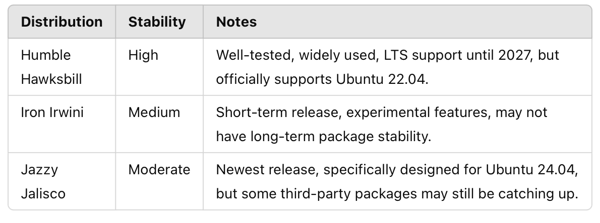
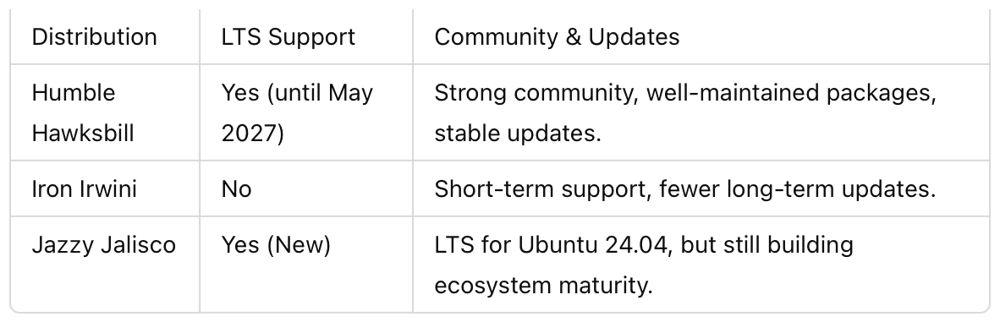

**ROS 2: Comparing Humble, Iron, and Jazzy**

Comparison of ROS 2 Distributions for Ubuntu 24.04

This section compares **Humble Hawksbill, Iron Irwini, and Jazzy Jalisco** against Ubuntu 24.04 in terms of package stability, support, and performance.

**Package Stability**

**Long-Term Support & Community Backing**

**Performance & Compatibility with Ubuntu 24.04**

**Summary of Comparison**

Humble Hawksbill is the most stable but does **not officially support** Ubuntu 24.04. Iron Irwini is experimental, **lacks LTS support**, and is not the best choice for production systems. Jazzy Jalisco is the official ROS 2 release for Ubuntu 24.04, ensuring the **best long-term support**.

### Additional References
- [Official ROS 2 Documentation](https://docs.ros.org/en/rolling/)
- [ROS 2 Discourse Discussion](https://discourse.ros.org/)
- [Comparison of ROS 2 Distributions](https://docs.ros.org/en/rolling/Releases.html)
- [Installing ROS 2 Jazzy on Ubuntu 24.04](https://docs.ros.org/en/jazzy/Installation/Ubuntu-Install-Debs.html)

