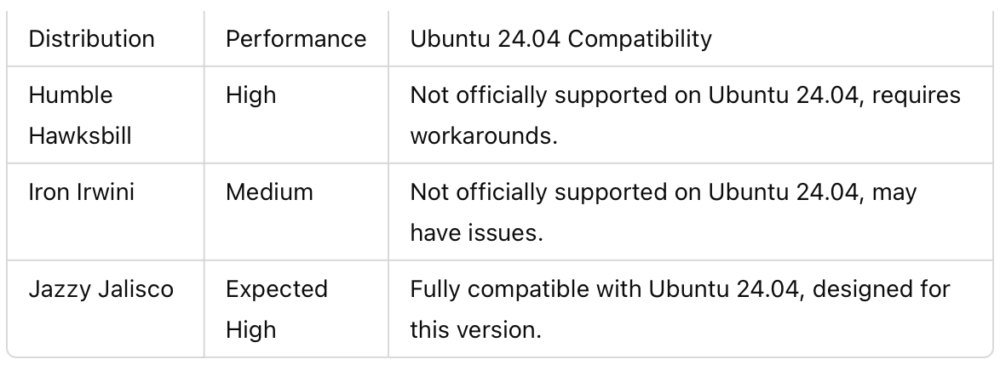

**ROS 2: Comparing Humble, Iron, and Jazzy**

Comparison of ROS 2 Distributions for Ubuntu 24.04

This section compares **Humble Hawksbill, Iron Irwini, and Jazzy Jalisco** against Ubuntu 24.04 in terms of package stability, support, and performance.

**Package Stability**

**Long-Term Support & Community Backing**

**Performance & Compatibility with Ubuntu 24.04**

**Summary of Comparison**

Humble Hawksbill is the most stable but does **not officially support** Ubuntu 24.04. Iron Irwini is experimental, **lacks LTS support**, and is not the best choice for production systems. Jazzy Jalisco is the official ROS 2 release for Ubuntu 24.04, ensuring the **best long-term support**.

## Choosing the Best ROS 2 Version for Ubuntu 24.04

### Why Jazzy Jalisco is the Best Choice

After evaluating package stability, long-term support, and compatibility, **Jazzy Jalisco** is the best ROS 2 distribution for Ubuntu 24.04.

1. **Full Compatibility**: It is the only ROS 2 version officially designed for Ubuntu 24.04, ensuring seamless integration ([docs.ros.org](https://docs.ros.org/en/jazzy/Installation/Ubuntu-Install-Debs.html)).
2. **Long-Term Support**: Jazzy Jalisco provides long-term support, making it a stable choice for production and future updates ([ROS 2 Discourse](https://discourse.ros.org/)).
3. **Performance Optimization**: Since it is built for the latest Ubuntu version, it takes full advantage of newer system improvements ([Comparison of ROS 2 Distributions](https://docs.ros.org/en/rolling/Releases.html)).
4. **Active Development**: Being the latest release, it will receive continued updates and bug fixes, ensuring reliability ([ROS 2 Official Documentation](https://docs.ros.org/en/rolling/)).
L
### Considerations Before Choosing Jazzy Jalisco
While Jazzy Jalisco is the best fit for Ubuntu 24.04, users should consider that some third-party packages may still be updating to fully support this version. If using legacy software, verify compatibility before upgrading ([ROS 2 Discourse](https://discourse.ros.org/)).

### Additional References
- [ROS 2 Official Documentation](https://docs.ros.org/en/rolling/)
- [ROS 2 Discourse Discussion](https://discourse.ros.org/)
- [Comparison of ROS 2 Distributions](https://docs.ros.org/en/rolling/Releases.html)
- [Installing ROS 2 Jazzy on Ubuntu 24.04](https://docs.ros.org/en/jazzy/Installation/Ubuntu-Install-Debs.html)

